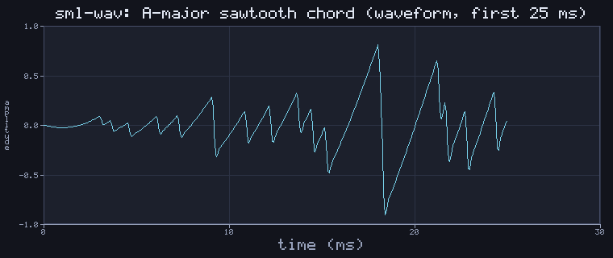
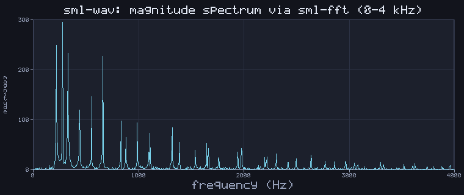

# sml-wav

[](https://github.com/sjqtentacles/sml-wav/actions/workflows/ci.yml)

WAV audio in pure Standard ML — read and write [RIFF/PCM](https://en.wikipedia.org/wiki/WAV)
`.wav` files, plus a small synthesis and DSP toolkit: `sine`/`saw`/`square`
oscillators, an ADSR envelope, RBJ biquad filters, and amplitude helpers. Built
on [`sml-fft`](https://github.com/sjqtentacles/sml-fft) and
[`sml-complex`](https://github.com/sjqtentacles/sml-complex) (used to verify
filters spectrally and to render the demo's spectrum). No FFI, no external
dependencies, and **deterministic** — encoded bytes are byte-identical under
both [MLton](http://mlton.org/) and [Poly/ML](https://www.polyml.org/).




*Generated by [`examples/demo.sml`](examples/demo.sml) (`make example`): a
one-second A-major chord built from three sawtooth oscillators, shaped with an
ADSR envelope and a 3 kHz lowpass, written to
[`assets/tone.wav`](assets/tone.wav), then plotted via
[`sml-plot`](https://github.com/sjqtentacles/sml-plot) — the waveform (first
25 ms) and the magnitude spectrum (via `Fft.rfft`, showing the sawtooth
harmonic series rolling off above the cutoff). The whole pipeline is exact /
libm-deterministic, so the `.wav` and both PNGs are byte-identical across
compilers.*

## Status

- 83 assertions, green on MLton and Poly/ML.
- Basis-library only; deterministic across compilers (encoded `.wav` and the
  demo PNGs are byte-identical run to run **and** between MLton and Poly/ML).
- Vendors `sml-fft` + `sml-complex` (Layout B), so the repo builds standalone.
  The example additionally vendors `sml-plot` (+ `sml-font`/`sml-raster`/
  `sml-image`/`sml-color`/`sml-inflate`) to render the waveform and spectrum.

## Install

With [`smlpkg`](https://github.com/diku-dk/smlpkg):

```
smlpkg add github.com/sjqtentacles/sml-wav
smlpkg sync
```

Include the MLB from your own (it pulls in the vendored `sml-fft` and
`sml-complex`):

```
local
  $(SML_LIB)/basis/basis.mlb
  lib/github.com/sjqtentacles/sml-wav/... (via smlpkg)
in
  ...
end
```

This brings `structure Wav` (and the vendored `Fft`, `Complex`) into scope.

## Quick start

```sml
(* synthesize a 440 Hz sine, shape it, and write a 16-bit mono .wav *)
val rate  = 44100
val tone  = Wav.sine { freq = 440.0, dur = 1.0, rate = rate }
val adsr  = { attack = 0.01, decay = 0.1, sustain = 0.7, release = 0.2 }
val voice = Wav.Adsr.apply adsr rate tone
val lp    = Wav.biquadLowpass { cutoff = 2000.0, q = 0.7071, rate = rate } voice

val pcm : Wav.pcm = { rate = rate, channels = 1, samples = Wav.normalize 0.9 lp }

val os = BinIO.openOut "tone.wav"
val () = BinIO.output (os, Wav.encode pcm)   (* 16-bit PCM WAVE *)
val () = BinIO.closeOut os

(* round-trip: decode recovers the same normalized samples *)
val back : Wav.pcm = Wav.decode (Wav.encode pcm)
```

## API (`signature WAV`)

```sml
type pcm = { rate : int, channels : int, samples : real array }
exception Wav of string

(* container I/O *)
val decode     : Word8Vector.vector -> pcm           (* 8/16/24/32-bit PCM *)
val encode     : pcm -> Word8Vector.vector           (* 16-bit PCM WAVE    *)
val encodeBits : int -> pcm -> Word8Vector.vector    (* 16 or 24           *)

(* oscillators: floor (dur * rate) samples, phase = freq * j / rate *)
val sine   : { freq : real, dur : real, rate : int } -> real array
val saw    : { freq : real, dur : real, rate : int } -> real array
val square : { freq : real, dur : real, rate : int } -> real array

(* amplitude helpers *)
val rms       : real array -> real
val peak      : real array -> real
val gain      : real -> real array -> real array
val mix       : real array list -> real array         (* zero-padded sum   *)
val normalize : real -> real array -> real array      (* scale peak->target *)

(* ADSR envelope *)
structure Adsr :
sig
  type t = { attack : real, decay : real, sustain : real, release : real }
  val envelope : t -> { rate : int, dur : real } -> real array
  val apply    : t -> int -> real array -> real array
end

(* RBJ biquad filters: spec -> (signal -> signal) *)
val biquadLowpass  : { cutoff : real, q : real, rate : int } -> real array -> real array
val biquadHighpass : { cutoff : real, q : real, rate : int } -> real array -> real array
```

### Representations & conventions

- **In memory**: a `pcm` record whose `samples` are normalized `real`s in
  `[~1.0, 1.0]`, interleaved by channel (frame 0 ch 0, frame 0 ch 1, …); the
  array length is a whole multiple of `channels`.
- **On disk**: a little-endian Microsoft WAVE blob — a `RIFF` chunk holding a
  16-byte PCM `fmt ` chunk and a `data` chunk. `decode` skips unknown chunks
  and handles 8/16/24/32-bit integer samples; `encode`/`encodeBits` emit 16- or
  24-bit PCM.
- **Quantization** is symmetric fixed-point: a sample `s` becomes the code
  `floor (clamp (s, ~1, 1) * S + 0.5)` with `S = 32767` (16-bit) or `8388607`
  (24-bit), and a code `k` decodes back to `k / S`. Rounding uses
  `floor (x + 0.5)` rather than `Real.round` (whose tie-to-even has differed
  between compilers), so encoded bytes are byte-identical across MLton and
  Poly/ML. Samples exactly on the grid (`k / S`) round-trip losslessly.
- **Oscillators**: `saw` and `square` use only exact arithmetic; `sine` uses
  `Math.sin`. Sample `j` has phase `freq * j / rate` cycles.
- **Filters** are RBJ audio-EQ-cookbook biquads run in Direct Form I from zero
  initial state; `biquadLowpass`/`biquadHighpass` return a pure
  `signal -> signal` function.

## Build & test

```
make test        # MLton: build + run the suite
make test-poly   # Poly/ML: use-and-run the suite
make all-tests   # both
make example     # synthesize assets/tone.wav + render the PNGs
make clean
```

Both compilers run the same strict-TDD suite (`test/`):

- **Container round-trip**: `decode (encode pcm)` recovers grid-aligned PCM
  exactly, with explicit byte assertions on the `RIFF`/`WAVE`/`fmt `/`data`
  tags, chunk sizes, `AudioFormat`, channels, sample/byte rate, block align and
  bit depth — for both 16- and 24-bit.
- **Sample-exact synthesis**: `sine`/`saw`/`square` values at known phases
  (e.g. a quarter-rate sine is `[0, 1, 0, ~1]`).
- **Amplitude bounds**: a whole-period sine has RMS `1/sqrt 2`; `peak`, `gain`,
  `mix`, and `normalize` are checked on exact data.
- **ADSR shape**: the piecewise-linear gain is asserted at every region
  boundary (attack → decay → sustain → release).
- **Filters, verified spectrally via `sml-fft`**: a 600 Hz lowpass strongly
  attenuates a 3 kHz tone (spectral peak and energy) while passing a 250 Hz
  tone; the highpass does the opposite.

### Poly/ML note

CI builds Poly/ML 5.9.1 from source rather than using the Ubuntu package
(Poly/ML 5.7.1), whose X86 code generator crashes (`asGenReg raised while
compiling`) on heavy real-arithmetic code. See `.github/workflows/ci.yml`.

## License

MIT — see [LICENSE](LICENSE).
